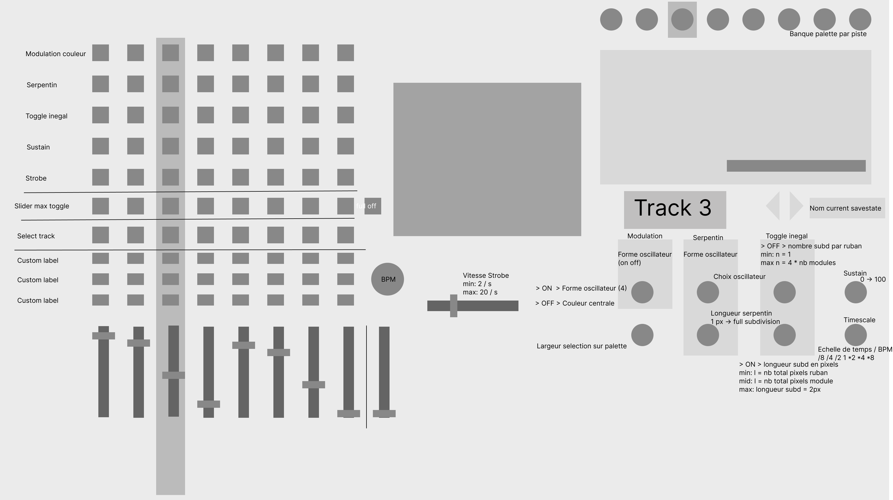

# optopoulpe-server
This repository holds a small server running on `bottle.py` that should be run on the raspberry pi that controls
the Optopoulpe setup. Everytime a consumer asks for the current state of the midi controller, the server parses the 
latest dump file created by the Optopoulpe driver and returns it in an easily usable json format.

Below is a mockup of the webpage that will be the first consumer of this server.





## Installation

```shell
virtualenv venv
source venv/bin/activate
pip install -r requirements.txt

# To start the app
python app/server.py
```


## Configuration

To change the location of the dump file that should be parsed, edit `app/server.py` and pass the file path as a string to
the `parse_dump_file` function call.

## Usage

Simply make a GET request to `127.0.0.1:8069/parse`, you will in return get an `application/json` response with the 
parsed dump data.

## Example

```shell
curl 127.0.0.1:8069/parse
```
```json
{
  "state": {
    "tracks": {
      "0": {
        "modulation": {
          "label": "Color Modulation",
          "enabled": false,
          "color_palette": {
            "selected_palette": 6,
            "width": 28,
            "offset": 85
          },
          "oscillator_track": null
        },
        "mask": {
          "label": "Mask",
          "enabled": false,
          "oscillator_track": 3,
          "length": 39,
          "is_move_enabled": true
        },
        "slicer": {
          "label": "Uneven Slicer",
          "enabled": false,
          "uneven_value": 124,
          "slices_value": 0,
          "is_flip_enabled": false,
          "is_ribbon_merge_enabled": true
        },
        "feedback": {
          "label": "Sustain",
          "enabled": false,
          "value": 72
        },
        "strobe": {
          "label": "Strobe",
          "enabled": false
        },
        "index": 0,
        "slider_value": null,
        "slider_max_enabled": false,
        "time_scale": 44,
        "is_on_group1": false,
        "is_on_group2": false,
        "is_on_group3": false
      },
      "1": {
        "modulation": {
          "label": "Color Modulation",
          "enabled": false,
          "color_palette": {
            "selected_palette": 2,
            "width": 37,
            "offset": 56
          },
          "oscillator_track": null
        },
        "mask": {
          "label": "Mask",
          "enabled": true,
          "oscillator_track": 3,
          "length": 35,
          "is_move_enabled": true
        },
        "slicer": {
          "label": "Uneven Slicer",
          "enabled": false,
          "uneven_value": 64,
          "slices_value": 21,
          "is_flip_enabled": false,
          "is_ribbon_merge_enabled": false
        },
        "feedback": {
          "label": "Sustain",
          "enabled": false,
          "value": 81
        },
        "strobe": {
          "label": "Strobe",
          "enabled": true
        },
        "index": 1,
        "slider_value": null,
        "slider_max_enabled": false,
        "time_scale": 111,
        "is_on_group1": true,
        "is_on_group2": true,
        "is_on_group3": true
      },
      "2": {
        "modulation": {
          "label": "Color Modulation",
          "enabled": true,
          "color_palette": {
            "selected_palette": 5,
            "width": 127,
            "offset": null
          },
          "oscillator_track": 2
        },
        "mask": {
          "label": "Mask",
          "enabled": true,
          "oscillator_track": 2,
          "length": 34,
          "is_move_enabled": true
        },
        "slicer": {
          "label": "Uneven Slicer",
          "enabled": false,
          "uneven_value": 0,
          "slices_value": 9,
          "is_flip_enabled": true,
          "is_ribbon_merge_enabled": false
        },
        "feedback": {
          "label": "Sustain",
          "enabled": false,
          "value": 93
        },
        "strobe": {
          "label": "Strobe",
          "enabled": true
        },
        "index": 2,
        "slider_value": null,
        "slider_max_enabled": false,
        "time_scale": 110,
        "is_on_group1": true,
        "is_on_group2": true,
        "is_on_group3": true
      },
      "3": {
        "modulation": {
          "label": "Color Modulation",
          "enabled": false,
          "color_palette": {
            "selected_palette": 2,
            "width": 75,
            "offset": 42
          },
          "oscillator_track": null
        },
        "mask": {
          "label": "Mask",
          "enabled": true,
          "oscillator_track": 2,
          "length": 32,
          "is_move_enabled": true
        },
        "slicer": {
          "label": "Uneven Slicer",
          "enabled": false,
          "uneven_value": 0,
          "slices_value": 127,
          "is_flip_enabled": true,
          "is_ribbon_merge_enabled": false
        },
        "feedback": {
          "label": "Sustain",
          "enabled": false,
          "value": 91
        },
        "strobe": {
          "label": "Strobe",
          "enabled": true
        },
        "index": 3,
        "slider_value": null,
        "slider_max_enabled": false,
        "time_scale": 127,
        "is_on_group1": true,
        "is_on_group2": true,
        "is_on_group3": true
      },
      "4": {
        "modulation": {
          "label": "Color Modulation",
          "enabled": true,
          "color_palette": {
            "selected_palette": 6,
            "width": 127,
            "offset": null
          },
          "oscillator_track": 3
        },
        "mask": {
          "label": "Mask",
          "enabled": true,
          "oscillator_track": 3,
          "length": 36,
          "is_move_enabled": true
        },
        "slicer": {
          "label": "Uneven Slicer",
          "enabled": false,
          "uneven_value": 0,
          "slices_value": 6,
          "is_flip_enabled": false,
          "is_ribbon_merge_enabled": true
        },
        "feedback": {
          "label": "Sustain",
          "enabled": true,
          "value": 75
        },
        "strobe": {
          "label": "Strobe",
          "enabled": false
        },
        "index": 4,
        "slider_value": null,
        "slider_max_enabled": false,
        "time_scale": 87,
        "is_on_group1": true,
        "is_on_group2": true,
        "is_on_group3": true
      },
      "5": {
        "modulation": {
          "label": "Color Modulation",
          "enabled": false,
          "color_palette": {
            "selected_palette": 2,
            "width": 0,
            "offset": 24
          },
          "oscillator_track": null
        },
        "mask": {
          "label": "Mask",
          "enabled": false,
          "oscillator_track": 0,
          "length": 0,
          "is_move_enabled": false
        },
        "slicer": {
          "label": "Uneven Slicer",
          "enabled": false,
          "uneven_value": 0,
          "slices_value": 0,
          "is_flip_enabled": false,
          "is_ribbon_merge_enabled": false
        },
        "feedback": {
          "label": "Sustain",
          "enabled": false,
          "value": 90
        },
        "strobe": {
          "label": "Strobe",
          "enabled": true
        },
        "index": 5,
        "slider_value": null,
        "slider_max_enabled": false,
        "time_scale": 64,
        "is_on_group1": true,
        "is_on_group2": true,
        "is_on_group3": true
      },
      "6": {
        "modulation": {
          "label": "Color Modulation",
          "enabled": false,
          "color_palette": {
            "selected_palette": 6,
            "width": 0,
            "offset": 53
          },
          "oscillator_track": null
        },
        "mask": {
          "label": "Mask",
          "enabled": true,
          "oscillator_track": 3,
          "length": 35,
          "is_move_enabled": true
        },
        "slicer": {
          "label": "Uneven Slicer",
          "enabled": true,
          "uneven_value": 0,
          "slices_value": 26,
          "is_flip_enabled": false,
          "is_ribbon_merge_enabled": true
        },
        "feedback": {
          "label": "Sustain",
          "enabled": true,
          "value": 83
        },
        "strobe": {
          "label": "Strobe",
          "enabled": false
        },
        "index": 6,
        "slider_value": null,
        "slider_max_enabled": false,
        "time_scale": 87,
        "is_on_group1": true,
        "is_on_group2": true,
        "is_on_group3": true
      },
      "7": {
        "modulation": {
          "label": "Color Modulation",
          "enabled": false,
          "color_palette": {
            "selected_palette": 5,
            "width": 0,
            "offset": 46
          },
          "oscillator_track": null
        },
        "mask": {
          "label": "Mask",
          "enabled": true,
          "oscillator_track": 2,
          "length": 59,
          "is_move_enabled": true
        },
        "slicer": {
          "label": "Uneven Slicer",
          "enabled": true,
          "uneven_value": 77,
          "slices_value": 0,
          "is_flip_enabled": false,
          "is_ribbon_merge_enabled": false
        },
        "feedback": {
          "label": "Sustain",
          "enabled": false,
          "value": 107
        },
        "strobe": {
          "label": "Strobe",
          "enabled": false
        },
        "index": 7,
        "slider_value": null,
        "slider_max_enabled": false,
        "time_scale": 90,
        "is_on_group1": true,
        "is_on_group2": true,
        "is_on_group3": true
      }
    },
    "current_selected_track_index": null,
    "current_selected_track": null,
    "kill_all_tracks_enabled": false,
    "bpm": 1376.0
  }
}
```